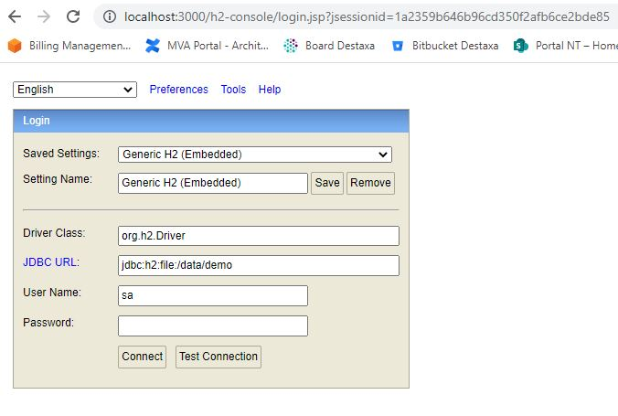
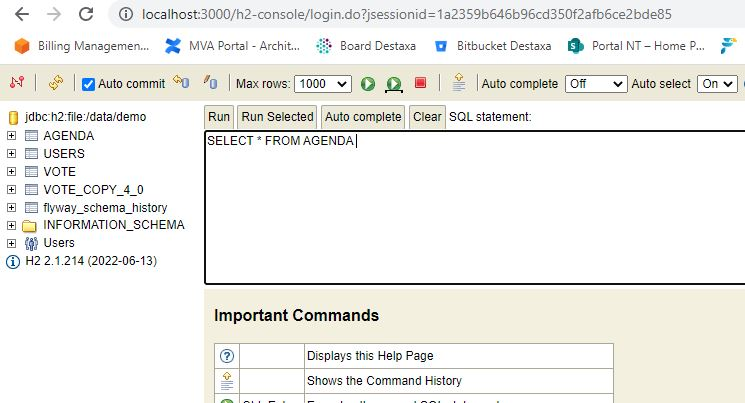
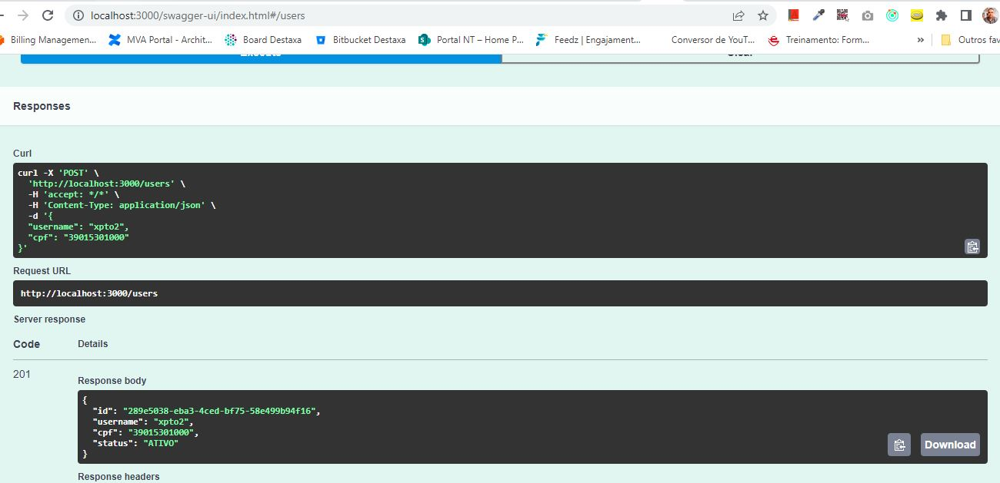
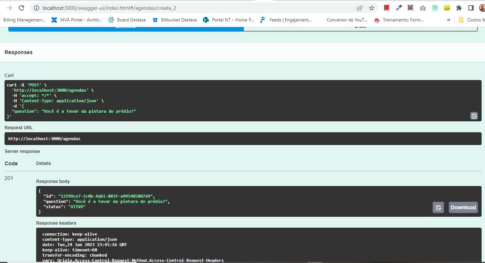
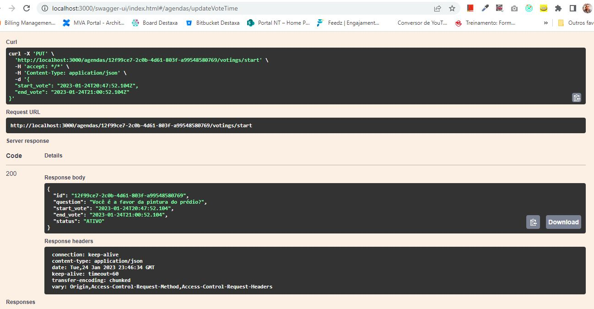
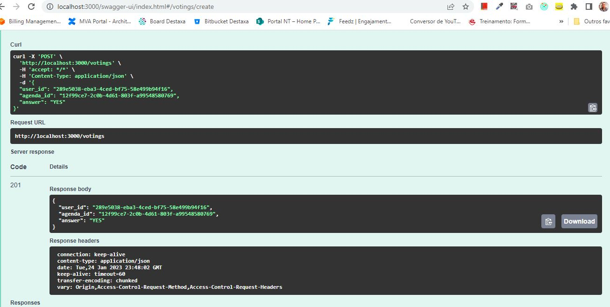
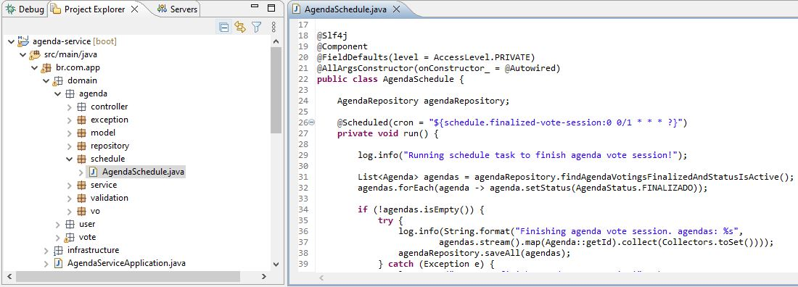

## About Me
[Carlos Maciel - Linkedin Profile](https://www.linkedin.com/in/carloshfmaciel/)

## About the project

This project was built to show knowledges about Java, Spring and REST apis as required at the [doc](docs/Desafio_Back.pdf).

## Starting project

```
mvn clean install
java -jar target/agenda-service-0.0.1-SNAPSHOT.jar
```

## Stack

- Features developed
  - REST apis using Spring
  - Swagger documentation for REST apis
  - Embedded database H2 using file persistence mode
  - Flyway as a database migration manager
  - Resilience4j as a circuit breaker for REST apis
  - Spring Rest Template as an external api caller
  - Spring Cron Scheduler to finish vote session
  - ActiveMQ Embeddable to produce async message when agenda vote session has finished

## Project organization

Trying to organize using clean code good pratices, each class was thought to have highly cohesion and low coupling.<br>
This way each class was developed to have as much as possible just one resposibility and represents only one operation, facilitating this way unit tests and of course, the mantainability. 


## Database ERD


## Unit Tests

Here, we have used mockito covering only the main services used by endpoint. It is always interest to cover 100% of service layer.


## Database

It is possible to access H2 database ui through url
```
http://localhost:3000/h2-console/login.jsp
```

** It is not necessary inform password





## How to vote

- 1 - Register a user with a valid cpf

- 2 - Register a agenda

- 3 - Define a schedule to start the vote
  - If no value is informed it immediately starts vote with a period of 1 minute from current time.

- 4 - Register a vote
  - Here the api will be request from cpf-service if user is able to vote. Randomly the cpf-service is returning yes or no, simulating some business rule. 


### Finishing voting session

Every minute has a cron that query database looking for some agenda whose end date is less than current time and has status "ATIVO".
When it is found, this cron updates agenda status to "FINALIZADO" and dispatch async message to topic.


