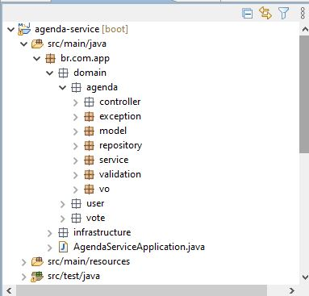
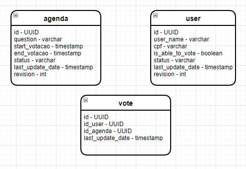
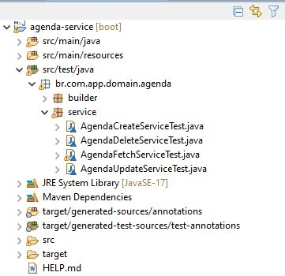

## About Me
[Linkedin](https://www.linkedin.com/in/carloshfmaciel/)

## About the project

This project was built to show knowledges about Java, Spring and REST apis as required at the [doc](docs/Desafio_Back.pdf).

## Starting project

```
mvn clean install
java -jar target/agenda-service-0.0.1-SNAPSHOT.jar
```

## Stack

- Features developed
  - REST apis using Spring
  - Swagger documentation for REST apis
  - Embedded database H2 using file persistence mode
  - Flyway as a database migration manager
  - Resilience4j as a circuit breaker for REST apis
  - Spring Rest Template as an external api caller
  - Spring Cron Scheduler to finish vote session
  - ActiveMQ Embeddable to produce async message when agenda vote session has finished

## Project organization

Trying to organize using clean code good pratices, each class was thought to have highly cohesion and low coupling.<br>
This way each class was developed to have as much as possible just one resposibility and represents only one operation, facilitating this way unit tests and of course, the mantainability. 



## Database ERD



## Unit Tests

Here, we have used mockito covering only the main services used by endpoint. It is always interest to cover 100% of service layer.


